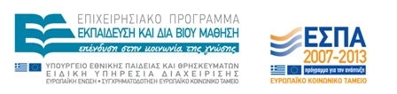
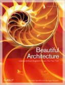
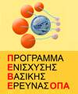
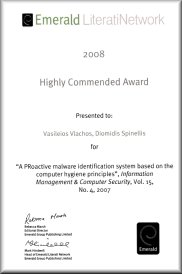
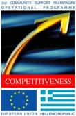
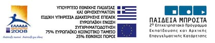

Title: phd achievements
slug: phd_achievements

  

    <h2>PhD Student Achievements</h2>
  

  

    

    

      <h3>July 2016</h3>
      

        <b>Georgios Gousios</b> gets hired as an assistant professor
        at the Web Information Systems group of the Faculty of Engineering,
        Mathematics and Computer Science (EEMCS/EWI), Delft University of Technology.
      

      <h3>January 2016</h3>
      

        Three new PhD students,
        <b>Tushar Sharma</b>,
        <b>Antonis Gkortzis</b>, and
        <b>Stefanos Georgiou</b>,
        begin their study funded by the
        highly-competitive EU
        "<a href="http://ec.europa.eu/research/mariecurieactions/about/innovative-training-networks_en">European Industrial Doctorates</a>"
      Marie Curie action through the
      <a href="http://senecaproject.github.io/">SENECA</a> project.
      

      <h3>April 2015</h3>
      

      
      <b>Vassilios Karakoidas</b> successfully defends his PhD thesis.
      

      <h3>December 2015</h3>
      

        <b>Maria Kechagia</b> publishes a paper in a high-impact journal:
        <a href="http://link.springer.com/article/10.1007%2Fs10664-014-9343-7">
          Charting the API minefield using software telemetry data
        </a>.
        <cite>Empirical Software Engineering</cite>, 2015.
      

      <h3>September 2014</h3>
      

      <b>Dimitris Mitropoulos</b> gets hired as a postdoctoral researcher
        at the Computer Science Department of Columbia University in the City
        of New York.
      

      <h3>April 2014</h3>
      

      <b>Marios Fragkoulis</b> publishes a paper in a high-rated conference:
      Relational access to Unix kernel data structures.
      Proceedings of the Ninth European Conference on Computer Systems (Eurosys '14).
      

      <h3>March 2014</h3>
      

      
      <b>Dimitris Mitropoulos</b> successfully defends his PhD thesis.
      

      <h3>September 2013</h3>
      

      <b>Dimitris Mitropoulos</b> is awarded the LASER Workshop Scholarship.
      The award was given by the organizing committee of the
      <a href="http://www.laser-workshop.org/">LASER</a>
      (Learning from Authoritative Security Experiment Results) Workshop.
      The committee makes available to students a limited number of scholarships to participate
      in the workshop and present their work (covering registration fee,
      travel costs and others).
      

      <h3>April 2012</h3>
      

      The paper <a href="http://www.emeraldinsight.com/journals.htm?articleid=1925947">
      Countering code injection attacks: A unified approach.</a>
      (<cite>Information Management and Computer Security</cite>, 19(3):177-194, 2011)
      co-authored by <b>Dimitris Mitropoulos</b> and <b>Vassilios Karakoidas</b>
      is awarded by
      <a href="http://www.emeraldinsight.com/">Emerald</a>
      publishers with the
      "Highly Commended Paper" distinction.
      The award was given by the journal's editorial board to three papers
      as part of the
      "Literati Network Awards for Excellence 2012".
      

      <h3>December 2011</h3>
      

      <b>Maria Kechagia</b> is awarded the Barclays
      capital prize for best competition entry by a
      female contestant, in the 2011 Algorithmic
      Trading Competition, organised by UCL
      UK. Member of the winning team was, also, the
      PhD student Conrad Felix Michel Landis, and
      supervisor Dr. Skouras, both from the
      department of International and European
      Economic Studies, Athens University of
      Economics and Business.
       
      
      

      <h3>September 2010</h3>
      

      <b>Marios Fragkoulis</b> is awarded a PhD research
      scholarship funded by the Propondis foundation.
       
      
      

      <h3>September 2010</h3>
      

      <b>Dimitris Mitropoulos</b> is awarded a scholarship co-funded by the European Social Fund and National Resources -
      IRAKLITOS II Fellowships for research of Athens University of Economics and Business.
       
      
      

      <h3>July 2009</h3>
      

      
      <b>Stephanos Androutsellis</b> successfully defends his PhD thesis.
      

      <h3>July 2009</h3>
      

      
      <b>Georgios Gousios</b> successfully defends his PhD thesis.
      

      <h3>February 2009</h3>
      

      
      The book
      <a href="http://oreilly.com/catalog/9780596517984/">Beautiful Architecture: Leading Thinkers Reveal the Hidden Beauty in Software Design</a>
      (O'Reilly, 2008,
      ISBN 9780596517984)
      co-edited by <b>Georgios Gousios</b>
      obtained the top rank on the amazon.co.uk Software Architecture books category.
      The book's royalties are donated to the
      international humanitarian aid organisation
      <a href="http://www.msf.org/">Médecins Sans Frontières</a>.
      

      <h3>February 2009</h3>
      

      
      <b>Vassilios Karakoidas</b> is awarded funding for his research through
      AUEB's Funding Programme for Basic Research (PEVE).
      

      <h3>January 2009</h3>
      

      <b>Dimitris Mitropoulos</b> publishes a paper in a high-impact journal:
      <a href="http://www.dmst.aueb.grps/pubs/jrnl/2009-CompSec-SQLIA/html/sqlia.html">SDriver: Location-specific signatures prevent SQL injection
      attacks</a>.
      <cite>Computers and Security</cite>, 2009.
      

      <h3>October 2008</h3>
      

      <b>Vasileios Vlachos</b> is elected Lecturer in the
      Department of Computer Science and Telecommunications
      at the Technological Educational Institution of Larissa.
      The subject of his post is the Development and Security of Internet Applications.
      

      <h3>September 2008</h3>
      

      <b>Vasileios Vlachos</b> publishes a paper he co-autored during his PhD study
      in a top-impact journal:
      <a href="http://www.dmst.aueb.grps/pubs/jrnl/2008-TOSEM-PowerLaws/html/LSV08.html">Power laws in software</a>.
      <cite>ACM Transactions on Software Engineering and Methodology</cite>,
      18(1):1-26, September 2008.
      Article 2.
      

      <h3>June 2008</h3>
      

      
      The paper
      <a href="http://www.dmst.aueb.grps/pubs/jrnl/2007-IMCS-Promise/html/VS07.html">A PRoactive
      Malware Identification System based on the Computer Hygiene Principles</a>
      (<cite>Information Management and Computer Security</cite>, 15(4):295-312, 2007)
      co-authored by <b>Vasileios Vlachos</b>
      <a href="http://info.emeraldinsight.com/authors/literati/awards.htm?jr=imcs">was awarded</a>
      by
      <a href="http://www.emeraldinsight.com/">Emerald</a>
      publishers with the
      "Highly Commended Paper" distinction.
      The award was given by the journal's editorial board to three papers
      as part of the
      "Literati Network Awards for Excellence 2008".
      

      <h3>May 2008</h3>
      

      <b>Vassilios Karakoidas</b> publishes a paper in a high-impact journal:
      <a href="http://www.dmst.aueb.grps/pubs/jrnl/2007-SPANDE-FIRE/html/KS07.html">FIRE/J - optimizing regular expression searches with generative
      programming</a>.
      <cite>Software: Practice &amp; Experience</cite>, 38(6):557-573, May 2008.
      

      <h3>November 2007</h3>
      

      
      <b>Konstantinos Chorianopoulos</b> is elected Lecturer in the
      Department of Informatics at the Ionian University.
      

      <h3>July 2007</h3>
      

      
      <b>Vasileios Vlachos</b> successfully defends his PhD thesis.
      

      <h3>April 2006</h3>
      

      The paper
      <a href="http://www.dmst.aueb.grps/pubs/jrnl/2004-ACMCS-p2p/html/AS04.html">A
      survey of peer-to-peer content distribution technologies</a>
      (<cite>ACM Computing Surveys</cite>, 36(4):335-371, December 2004)
      co-authored by <b>Stephanos Androutsellis Theotokis</b>
      obtained the top yearly download rank in the ACM's digital library
      popular magazine and computing surveys articles category.
       
        
      Table from the
      <em>Communications of the ACM</em> Volume 49, Number 4 (2006), Pages 29-30.
      

      <h3>January 2006</h3>
      

      
      <b>Stephanos Androutsellis Theotokis</b>,
      <b>Georgios Gousios</b>, and
      <b>Konstantinos Stroggylos</b>
      are awarded a scholarhip through the
      framework of the "Reinforcement Programme of Human Research Manpower"
      (PENED) co-financed by National and Community Funds
      (25% from the Greek Ministry of Development-General Secretariat of Research and Technology and 75% from E.U.-European Social Fund).
      

      <h3>December 2004</h3>
      

      <b>Stephanos Androutsellis Theotokis</b> publishes a paper in a top-impact journal:
      <a href="http://www.dmst.aueb.grps/pubs/jrnl/2004-ACMCS-p2p/html/AS04.html">A
      survey of peer-to-peer content distribution technologies</a>.
      <cite>ACM Computing Surveys</cite>, 36(4):335-371, December 2004.
      

      <h3>July 2004</h3>
      

      <b>Vasileios Vlachos</b> is awarded a scholarship
      co-funded by the European Social Fund and National Resources - EPEAEK II -
      IRAKLITOS Fellowships for research of
      Athens University of Economics and Business.
      
      

      <h3>June 2004</h3>
      

      <b>Vasileios Vlachos</b> and <b>Stefanos Androutsellis Theotokis</b> publish a paper in a high-impact journal:
      <a href="http://www.dmst.aueb.grps/pubs/jrnl/2004-CompSec-p2pav/html/VAS04.html">Security applications of peer-to-peer networks</a>.
      <cite>Computer Networks</cite>, 45(2):195-205, June 2004.
      

      <h3>May 2004</h3>
      

      
      <b>Konstantinos Chorianopoulos</b> successfully defends his PhD thesis.
      

      <h3>May 2004</h3>
      

      <b>Konstantinos Chorianopoulos</b> publishes a paper in a high-impact journal:
      <a href="http://www.dmst.aueb.grps/pubs/Old/jrnl/2004-CG-ITV/html/CS04.htm">User
      interface development for interactive television: Extending a commercial
      h3V platform to the virtual channel API</a>.
      <cite>Computers &amp; Graphics</cite>, 28(2):157-166, April 2004.
      

      <h3>April 2004</h3>
      

      
      <b>Vasileios Vlachos</b> coordinated the student team that won the third place
      in the national phase of the Microsoft Imagine Cup 2004 competition.
      

      <h3>December 2004</h3>
      

      The paper
      <a href="http://www.dmst.aueb.grps/pubs/jrnl/2004-ACMCS-p2p/html/AS04.html">A
      survey of peer-to-peer content distribution technologies</a>
      (<cite>ACM Computing Surveys</cite>, 36(4):335-371, December 2004)
      co-authored by <b>Stephanos Androutsellis Theotokis</b>
      obtained the top monthly download rank in the ACM's digital library
      popular magazine and computing surveys articles category.
       
        
      Table from the
      <em>Communications of the ACM</em> Volume 48, Number 9 (2005), Pages 29-30.
      

      <h3>June 2002</h3>
      

      
      <b>Konstantinos Raptis</b> successfully defends his PhD thesis.
      

      <h3>May 2002</h3>
      

      
      Best refereed paper award for the paper: Giorgos Gousios and Diomidis Spinellis. A comparison of portable dynamic web content
      technologies for the apache web server. In <i>Proceedings of the 3rd International
      System Administration and Networking Conference</i> SANE 2002, pages 103–119, May 2002.

      

      <h3>June 2000</h3>
      

      <b>Konstantinos Raptis</b> publishes a paper in a high-impact journal:
      <a href="http://www.dmst.aueb.grps/pubs/Old/jrnl/2000-IST-Components/html/comp.html">Component mining: A process and its pattern language</a>.
      <cite>Information and Software Technology</cite>, 42(9):609-617, June 2000.
      

    

    

  

  

    <i class="text-muted">Note: Some of the above data refer to grandfathered work conducted by BALab's members at its progenitor laboratory, <a href="https://istlab.dmst.aueb.gr">ISTLab</a>.</i>
  

